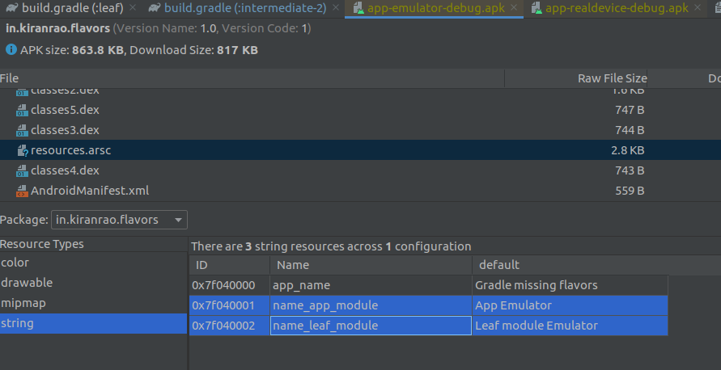
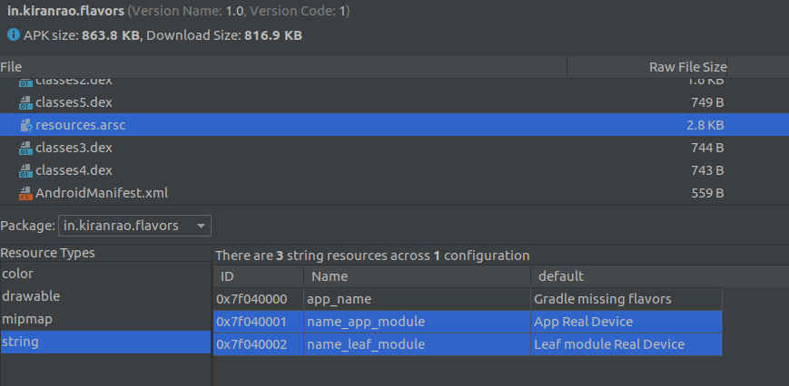
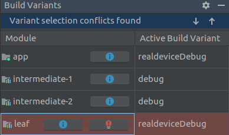

This repo demonstrates the use of Android Gradle Plugin's `matchingFallbacks` and `missingDimensionStrategy` features. These are used when an Android project has multiple modules with dependencies on each other, and these **modules do not agree on the number of flavor dimensions** or flavors.

## Repo structure

The app itself is a shell. It has no activities, no functionality and almost no Android code. It has 4 modules:

1. `app` module. Depends on `intermediate-1`,`intermediate-2` and `leaf`
2. `intermediate-1` module. Depends on `leaf`
3. `intermediate-2` module. Depends on `leaf`
4. `leaf` module. Has no dependencies

### Flavors

  - Only `app` and `leaf` modules care about flavors. I named the dimension as "target" and the flavors as "emulator" and "realdevice" but it doesn't really matter what you call them.
  - The intermediate modules don't care and don't even need to know about flavors.

### String resources

To demonstrate how flavors work, I've created some string resources (using gradle's `resValue` feature) in every flavor, in every module that does care about the flavor. When I build an APK for a particular flavor, I can inspect the string resource in APK analyzer to figure out which variant was used.

### In this commit

In this commit, you see that we use the `missingDimensionStrategy` DSL to select a default flavor when a consuming module does not include a flavor dimension that the consumed module does. In particular in both `intermediate-` modules, we have the following in build.gradle

```
missingDimensionStrategy 'target', 'emulator'
```

If you generate the APKs with these changes, you see everything works as expected. Here's what the emulatorDebug flavor looks like:



And this is the realdeviceDebug variant



### What's wrong?

Though things seem to work as expected, there's still something wrong. The clue is in the "Build Variants" window. Select `realdeviceDebug` variant and you'll see this:



And here's a warning message in the build output:

> Module 'leaf' has variant 'realdeviceDebug' selected, but the modules ['intermediate-1', 'intermediate-2'] depend on variant 'emulatorDebug'

The problem is this: When you chose `realdeviceDebug` variant for `app` module, the same variant is selected for `leaf` module. However, for the intermediate modules, we specified we want to use `emulator` flavor.

This is not a problem for us because we explicitly stated that the intermediate flavors don't know or care about flavors. But, how do you fix those warnings?

We'll explore this in future commits.

